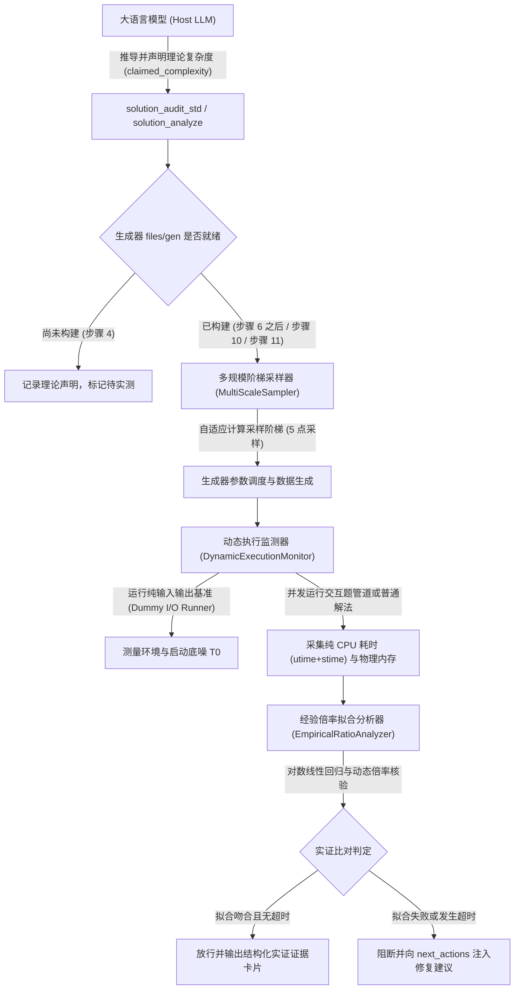

# 多规模阶梯数据采样与经验复杂度拟合工具链设计

## 一、设计目标与问题分析

### 1. 现状问题
在现有工具链实现中，`src/autocode_mcp/tools/complexity.py`、`src/autocode_mcp/tools/solution_audit.py` 与 `src/autocode_mcp/tools/audit.py` 依赖基于正则表达式的代码静态分析（例如通过匹配 `for` 循环和大括号深度推断循环层级，通过搜索关键词识别算法模式）。

这种静态分析方法存在固有缺陷：
- 无法感知算法常数：二重循环若内层迭代次数为固定常数，会被误判定为二次时间复杂度。
- 无法分析均摊复杂度：对于双指针移动、并查集路径压缩、单调队列等经典算法，虽然代码包含嵌套循环，但总时间复杂度为线性，静态规则会产生大量误报。
- 无法分析递归与剪枝：记忆化搜索或折半搜索的代码结构无法通过大括号层级推导其实际执行步数。

### 2. 设计原则
- **大语言模型负责理论推演与声明**：由大语言模型深入理解算法逻辑，推导理论渐进复杂度并在参数中声明（如 `claimed_complexity`、算法证明、关键瓶颈点）。
- **工具链负责物理测量与经验拟合**：工具链通过调度数据生成器构造多个阶梯规模的测试数据，实际编译运行程序并采集纯 CPU 耗时与物理内存，计算时间增长倍率并进行对数线性拟合，实现对大语言模型理论声明的实证核验。
- **工作流时序两阶段协同**：在步骤 4（解法审计阶段）执行理论声明与结构分析，若生成器尚未构建则标记为待实测；在步骤 6（生成器构建）之后以及步骤 10（测试验证）与步骤 11（全量审计）中自动触发多规模实测与经验拟合，解决时序依赖冲突。
- **接口兼容与客观门禁**：保持 22 个 MCP 工具签名与现有对外接口不变，在门禁中提供包含多规模实测数据的结构化证据，杜绝基于猜测的误报。

---

## 二、系统架构与处理流程



---

## 三、核心模块详细设计

### 1. 多规模阶梯数据采样器（MultiScaleSampler）

根据大语言模型声明的时间复杂度类别与约束规模 $N_{\max}$，自适应计算采样点数值，避免采样点倒挂：

1. **多项式时间复杂度（$N_{\max} \ge 1000$）**：
   采用 5 点阶梯采样，覆盖不同数量级：
   - $N_1 = \max(100, \lfloor N_{\max} \times 0.02 \rfloor)$
   - $N_2 = \max(200, \lfloor N_{\max} \times 0.05 \rfloor)$
   - $N_3 = \max(500, \lfloor N_{\max} \times 0.10 \rfloor)$
   - $N_4 = \max(1000, \lfloor N_{\max} \times 0.30 \rfloor)$
   - $N_5 = N_{\max}$
   严格保证 $N_1 < N_2 < N_3 < N_4 < N_5 \le N_{\max}$。

2. **小规模多项式时间复杂度（$N_{\max} < 1000$）**：
   采用等比动态比例缩放：
   - $N_1 = \max(10, \lfloor N_{\max} \times 0.20 \rfloor)$
   - $N_2 = \lfloor N_{\max} \times 0.40 \rfloor$
   - $N_3 = \lfloor N_{\max} \times 0.60 \rfloor$
   - $N_4 = \lfloor N_{\max} \times 0.80 \rfloor$
   - $N_5 = N_{\max}$

3. **指数与阶乘时间复杂度（$N_{\max} \le 30$）**：
   采用增量线性阶梯，杜绝指数爆炸：
   - $N_1 = \max(4, N_{\max} - 4)$
   - $N_2 = N_{\max} - 3$
   - $N_3 = N_{\max} - 2$
   - $N_4 = N_{\max} - 1$
   - $N_5 = N_{\max}$

4. **对数与常数时间复杂度（$O(\log N)$ / $O(1)$）**：
   在基准点 $N_1$ 与极限点 $N_5$ 执行物理运行，验证绝对耗时处于极小常数区间。

### 2. 动态执行监测器（DynamicExecutionMonitor）

1. **纯 CPU 时间采集**：
   - 在 Linux 操作系统中，调用 `getrusage(RUSAGE_CHILDREN)` 或直接读取 `/proc/[pid]/stat` 获取子进程的 `utime`（用户态时间）与 `stime`（内核态时间），彻底剥离操作系统进程派生、动态库加载以及管道初始化的物理挂钟时间。
   - 在 Windows 操作系统中，在子进程退出后调用 `GetProcessTimes` 函数分别获取目标进程的 `UserTime` 与 `KernelTime` 之和。在评测期间调用 `timeBeginPeriod(1)` 提升定时器分辨率至 1 毫秒，评测完成后调用 `timeEndPeriod(1)` 还原。

2. **环境底噪扣除（Dummy I/O Runner）**：
   在执行待测算法前，先行运行仅包含相同输入读取逻辑的空操作基准程序，测量纯输入输出与环境初始化耗时 $T_0$。在计算算法实际耗时时执行 $T_{\text{calc}} = \max(0.1, T_{\text{measured}} - T_0)$，消除小规模测点下的环境底噪压缩，杜绝小常数二次方算法被误判放行。

3. **短耗时自适应提升**：
   当基准点纯计算耗时低于 5 毫秒的安全信噪比门限时，自适应向上调整低阶规模参数，确保采样点处于高信噪比区间。

4. **进程与资源安全控制**：
   - Linux 环境下创建子进程时开启 `start_new_session=True`，发生超时或异常时向进程组发送 `SIGKILL` 信号（`os.killpg`）进行原子化清理。
   - Windows 环境下为子进程关联 Job Object 并配置 `JOB_OBJECT_LIMIT_KILL_ON_JOB_CLOSE` 标志，由操作系统内核执行深层回收。
   - 标准输入输出采用异步非阻塞读取机制，重定向至带大小上限的缓冲区，避免缓冲区填满引发主控与子进程相互挂起。

5. **交互题双向管道调度管线**：
   当 `manifest.json` 声明 `interactive: true` 时，并发启动 `files/interactor` 与 `solutions/sol`，通过匿名管道互联两者的标准输入输出，独立采集 `sol` 进程的 CPU 时间，排除交互器自身的计算与调度干扰。

### 3. 经验倍率拟合分析器（EmpiricalRatioAnalyzer）

1. **动态理论倍率计算模型**：
   废除固定的 10 倍倍率表，根据实际采样的具体规模数值 $N_a$ 与 $N_b$（$N_a < N_b$），动态计算理论期望倍率：
   $$R_{\text{expected}} = \frac{f(N_b)}{f(N_a)}$$
   实际观测倍率为 $R_{\text{observed}} = \frac{T_{\text{calc}}(N_b)}{T_{\text{calc}}(N_a)}$。
   容差区间动态调节：
   $$R_{\text{observed}} \in \left[ R_{\text{expected}} \times (1 - \delta), R_{\text{expected}} \times (1 + \delta) \right]$$
   容差系数 $\delta$ 依据基准点耗时自适应设定。

2. **对数线性回归拟合模型**：
   通过 5 个阶梯采样点拟合经验幂函数模型：
   $$\ln(T_{\text{calc}}(N)) = \alpha \ln N + \beta$$
   对拟合所得的幂指数 $\alpha$ 进行区间核验：
   - 线性复杂度 $O(N)$：$\alpha \in [0.8, 1.3]$
   - 线性对数复杂度 $O(N \log N)$：$\alpha \in [1.0, 1.4]$
   - 二次方复杂度 $O(N^2)$：$\alpha \in [1.7, 2.3]$
   - 三次方复杂度 $O(N^3)$：$\alpha \in [2.6, 3.4]$
   结合判定系数 $R^2 \ge 0.85$ 评估拟合优度，消除大常数项对增长率的稀释影响。

3. **处理器缓存容量跨越保护**：
   实施双区间联合校验。若仅在极限点 $N_5$ 发生微幅跳跃，且极限点绝对耗时处于时限的安全比例内（例如低于时限的 50%），判定为硬件缓存效应并予以放行，记录分析说明。

---

## 四、接口契约与数据结构规范

### 1. 输入参数归一化与轻量化

大语言模型调用 `solution_analyze` 与 `solution_audit_std` 时，`claimed_complexity` 为可选参数（`Optional[str] = None`）。
工具端实施输入归一化解析：
- 自动消除空白字符、转换为小写字符。
- 自动去除 LaTeX 转义符（例如 `\log` 转换为 `log`，`\cdot` 转换为 `*`）。
- 规模变量范围与时限自动从 `.autocode/manifest.json` 中提取，无需大语言模型重复传递。

### 2. 结构化返回格式规范

#### 验证通过时的返回结构（嵌入 `data["empirical_verification"]`）：
```json
{
  "empirical_verification": {
    "passed": true,
    "verdict": "verified",
    "claimed_complexity": "O(n log n)",
    "fitted_complexity": "O(n log n)",
    "fitted_alpha": 1.12,
    "r_squared": 0.985,
    "samples": [
      {"n": 2000, "cpu_time_ms": 2.4, "memory_mb": 3.1, "status": "ok"},
      {"n": 5000, "cpu_time_ms": 6.8, "memory_mb": 4.2, "status": "ok"},
      {"n": 10000, "cpu_time_ms": 14.5, "memory_mb": 6.0, "status": "ok"},
      {"n": 30000, "cpu_time_ms": 48.2, "memory_mb": 11.5, "status": "ok"},
      {"n": 100000, "cpu_time_ms": 175.0, "memory_mb": 24.8, "status": "ok"}
    ],
    "growth_ratios": [
      {"from_n": 10000, "to_n": 100000, "scale_factor": 10.0, "observed_ratio": 12.07, "expected_ratio": 12.5}
    ],
    "max_scale_headroom_ratio": 0.175
  }
}
```

#### 验证失败阻断时的返回结构：
```json
{
  "empirical_verification": {
    "passed": false,
    "verdict": "ratio_mismatch",
    "failure_reason": "Measured growth ratio 92.5x significantly exceeds theoretical expectation [10.0x, 15.0x] for O(n log n)",
    "claimed_complexity": "O(n log n)",
    "fitted_complexity": "O(n^2)",
    "fitted_alpha": 2.04,
    "r_squared": 0.991,
    "samples": [
      {"n": 2000, "cpu_time_ms": 2.1, "memory_mb": 3.0, "status": "ok"},
      {"n": 5000, "cpu_time_ms": 13.5, "memory_mb": 4.1, "status": "ok"},
      {"n": 10000, "cpu_time_ms": 55.2, "memory_mb": 6.0, "status": "ok"},
      {"n": 30000, "cpu_time_ms": 502.1, "memory_mb": 11.2, "status": "ok"},
      {"n": 100000, "cpu_time_ms": null, "memory_mb": null, "status": "timeout"}
    ],
    "remediation_advice": "The implementation exhibits quadratic growth O(n^2). Please inspect nested loops, optimize algorithm logic to O(n log n), or update claimed_complexity in manifest if quadratic complexity is intended."
  }
}
```

在 `problem_audit` 中，若经验拟合未通过，向 `blocking_issues` 追加条目，并在 `next_actions` 列表中生成优先级为 `high` 的优化建议动作。

---

## 五、测试套件详细设计

### 1. 单元测试（Unit Tests）
- `tests/test_tools/test_empirical_ratio_analyzer.py`：
  - 典型复杂度曲线拟合测试（$O(N), O(N \log N), O(N^2), O(N^3)$ 样本）。
  - 动态倍率期望与容差区间计算测试。
  - 测量波动（$\pm 15\%$）抗干扰鲁棒性测试。
  - 逆序耗时样本异常识别测试。
  - 环境底噪扣除稳定性测试。
- `tests/test_tools/test_multi_scale_sampler.py`：
  - 采样点数值计算单调性测试（覆盖多项式、小规模、指数级边界）。
  - 生成器调用参数规范格式化测试。
- `tests/test_utils/test_dynamic_execution_monitor.py`：
  - 跨平台纯 CPU 耗时采集精度测试（Linux 与 Windows）。
  - 异常超时进程树原子化清理测试。

### 2. 端到端集成测试（Integration Tests）
- `tests/test_integration/test_complexity_empirical_e2e.py`：
  - 正确线性标答放行测试（单调队列或双指针）。
  - 小常数二次方算法阻断测试（在 $N=10000$ 下被准确识别并阻断）。
  - 交互题双向管道执行与 CPU 时间采集测试。
  - 多测数据极端分布（大 $T$ 小 $N$ 与小 $T$ 大 $N$）评测。
